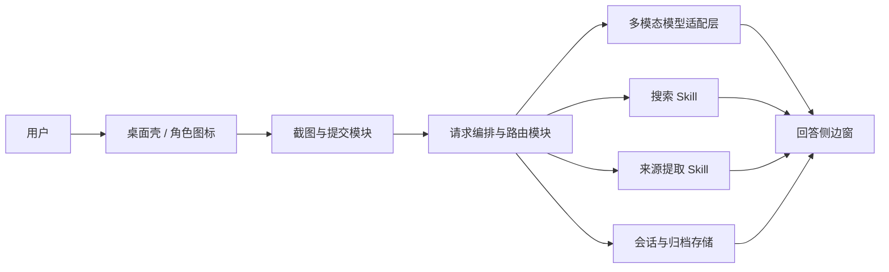

# 桌面上下文 AI 老师助手 SRS v0

状态：Draft  
范围：MVP / V0  
对应 PRD：[docs/prd-v0.md](/mnt/e/my_github/Desktop-Teacher/docs/prd-v0.md)

## 1. 文档目的

本 SRS 用于把 PRD 中的产品目标、交互约束和已拍板决策，转写为可设计、可实现、可验证的系统需求。

本文档优先回答以下问题：

- 系统到底要做什么，不做什么。
- 各模块之间如何分工。
- 哪些需求是必须满足的 SHALL 级约束。
- 后续实现完成后，如何判断系统“真的满足需求”。

## 2. 系统范围

本系统是一个面向 Windows 学习者的桌面 AI 老师助手。

用户在电脑上遇到看不懂的内容时，可以通过快捷键截图，并附带一个简短问题提交给系统。系统基于截图和文本问题进行理解，默认以“老师式讲解”方式在屏幕侧边小窗中返回回答；当问题需要最新信息或外部能力时，系统可在白名单范围内自动或手动调用联网搜索与来源提取能力。

本 SRS 仅覆盖 V0 / MVP。

## 3. 术语与定义

- `老师`：产品核心价值层，负责解释、拆解、启发和辅导。
- `助手`：能力层，负责调用外部工具完成搜索、来源提取等补充能力。
- `角色图标`：桌面右下角的常驻轻量形象，用于存在感、状态提示和入口召回。
- `skill`：系统允许模型调用的外部能力单元。V0 仅包含联网搜索与网页来源提取。
- `运行时上下文`：当前打开聊天窗口内保留的会话状态。
- `历史会话归档`：用户关闭窗口后仍被保存、可重新打开继续对话的历史线程。
- `自动路由`：系统依据问题类型和模型判断，在白名单范围内决定是否调用 skill。

## 4. 参考文档

- [docs/prd-v0.md](/mnt/e/my_github/Desktop-Teacher/docs/prd-v0.md)
- [docs/exec-plans/index.md](/mnt/e/my_github/Desktop-Teacher/docs/exec-plans/index.md)

## 5. 系统概览

### 5.1 产品定位

该系统不是泛用型桌面 agent，也不是以养成玩法为主的宠物应用。

该系统的核心承诺是：

> 当用户看不懂当前屏幕上的内容时，可以不切屏、原地提问、原地得到讲解。

### 5.2 目标用户

V0 首个目标用户为学习者 / 自学者，典型场景包括：

- 阅读英文资料、教程、PDF 或网页。
- 观看课程或视频时看到不理解的图表、公式或界面。
- 遇到术语、概念、报错信息，希望快速得到解释而不离开当前任务。

### 5.3 系统边界

V0 系统边界如下：

- 包含：Windows 桌面壳、角色图标、截图触发、截图确认、图片+文本问答、侧边回答小窗、多轮追问、历史会话归档、联网搜索、来源提取。
- 不包含：持续屏幕监听、自动操作电脑、任意文件扫描、多步 agent、社交功能、宠物养成。

### 5.4 高层组件

## 6. 设计约束与假设

### 6.1 已确认约束

- 系统首发平台仅支持 Windows。
- 角色图标默认位于屏幕右下角。
- 主要入口为全局快捷键截图。
- 回答窗口默认显示在屏幕侧边。
- 默认回答风格为老师式讲解。
- 语音输入严格进入 V1，不属于 V0。
- 能力路由采用 `model-first, skill-on-demand`。
- V0 skill 白名单仅包含：
  - 联网搜索
  - 网页来源提取
- 关闭聊天窗口后必须清空运行时上下文。
- 系统必须保留历史会话归档，并允许用户手动续聊。
- V0 历史会话归档默认仅本地存储，不做云同步。
- 模型接入层暂定兼容 OpenAI 与 Qwen 两类 provider。

### 6.2 关键假设

- 用户愿意接受截图上传给外部模型服务进行理解。
- V0 以 `截图 + 可选文本问题` 为主输入模式。
- 模型供应商和具体模型 ID 可以更换，但对上层产品行为应保持一致的接口契约。
- 上层业务逻辑不应直接依赖某一家 provider 的 SDK 细节。

### 6.3 未定项

- `TBD-1`：OpenAI provider 首选接入的具体模型 ID 与请求参数。
- `TBD-2`：Qwen provider 首选接入的具体模型 ID 与请求参数。
- `TBD-3`：provider 适配层是统一 OpenAI-compatible 接口优先，还是分别维护 OpenAI/Qwen 原生适配器。

## 7. 用户用例

### UC-01 截图并提问

- 参与者：用户
- 前置条件：应用已启动，角色图标可见
- 触发条件：用户按下全局快捷键
- 主流程：
  1. 系统进入截图模式。
  2. 用户框选区域或选择当前窗口。
  3. 系统展示确认界面。
  4. 用户输入问题或直接提交。
  5. 系统分析截图并返回回答。
  6. 回答在侧边窗中展示。
- 成功结果：用户获得可读、可继续追问的回答

### UC-02 仅凭截图请求解释

- 参与者：用户
- 前置条件：截图已完成
- 触发条件：用户不输入问题，直接提交
- 主流程：
  1. 系统读取截图内容。
  2. 系统以老师式结构解释图片中的主要内容。
- 成功结果：用户无需组织语言也能获得解释

### UC-03 自动或手动触发联网

- 参与者：用户、系统
- 前置条件：当前问题涉及最新信息、来源要求或外部资料
- 触发条件：
  - 用户显式要求搜索
  - 系统自动判断必须联网
- 主流程：
  1. 系统显示“正在搜索/正在调用工具”状态。
  2. 系统调用搜索 skill 和/或来源提取 skill。
  3. 系统将结论和来源一起展示。
- 成功结果：回答附带来源，且用户知道发生了工具调用

### UC-04 基于同一截图继续追问

- 参与者：用户
- 前置条件：侧边聊天窗仍处于打开状态
- 触发条件：用户在当前窗内继续输入问题
- 主流程：
  1. 系统保留当前会话上下文。
  2. 用户继续追问。
  3. 系统基于当前上下文继续回答。
- 成功结果：用户无需重复上传相同截图即可继续对话

### UC-05 打开历史会话并续聊

- 参与者：用户
- 前置条件：至少存在一条历史会话归档
- 触发条件：用户从历史列表打开某一条会话
- 主流程：
  1. 系统加载该历史会话。
  2. 用户查看旧对话。
  3. 用户继续输入新问题。
  4. 系统在该历史线程下继续对话。
- 成功结果：用户可基于过去对话继续，而不是从零开始

### UC-06 删除历史会话

- 参与者：用户
- 前置条件：存在至少一条历史会话归档
- 触发条件：用户执行删除操作
- 主流程：
  1. 系统要求用户确认删除。
  2. 用户确认。
  3. 系统删除会话及其关联附件。
- 成功结果：指定历史会话被移除且不可继续访问

## 8. 功能需求

### 8.1 桌面壳与角色图标

- `FR-001` 系统必须在 Windows 上以桌面应用形式运行。
- `FR-002` 系统启动后必须在屏幕右下角显示常驻角色图标。
- `FR-003` 角色图标必须至少支持以下状态反馈：
  - 空闲
  - 处理中
  - 错误
- `FR-004` 角色图标不得频繁主动打扰用户，不得遮挡系统关键 UI。

### 8.2 截图与提交

- `FR-010` 系统必须提供至少一个全局快捷键用于发起截图。
- `FR-011` 系统必须支持区域截图。
- `FR-012` 系统必须支持当前窗口截图。
- `FR-013` 截图完成后，系统必须展示确认与提交界面。
- `FR-014` 用户必须可以在提交前取消本次截图。
- `FR-015` 用户必须可以在截图后输入一个简短文本问题。
- `FR-016` 用户必须可以在不输入文本问题的情况下直接提交截图。
- `FR-017` 系统不得在没有用户明确触发的情况下主动截取屏幕内容。
- `FR-018` V0 不得要求语音输入作为主流程的一部分。

### 8.3 侧边回答窗

- `FR-020` 系统必须将回答展示在固定侧边窗中，而非贴近截图区域的漂浮泡泡。
- `FR-021` 回答窗必须支持打开、关闭、收起、固定位置。
- `FR-022` 回答窗必须支持在同一线程内继续追问。
- `FR-023` 系统展示回答时，不得强制把用户切离当前前台应用。
- `FR-024` 回答窗应优先展示简洁答案，并允许展开更多内容。

### 8.4 图片理解与回答生成

- `FR-030` 系统必须能处理 `截图 + 可选文本问题` 的多模态输入。
- `FR-031` 系统必须对截图中的文字、界面、图表和基础视觉结构进行理解。
- `FR-032` 当截图内容可理解但缺少明确问题时，系统必须给出默认解释。
- `FR-033` 默认回答必须采用老师式讲解结构，至少覆盖：
  - 这是什么
  - 为什么重要
  - 如何理解或下一步怎么做
- `FR-034` 当用户提出技术性问题时，系统应优先给出排查思路，而不是仅输出结论。
- `FR-035` 当系统对截图理解置信度不足时，必须优先追问或触发补充能力，而不是直接编造。

### 8.5 路由与 skill 调用

- `FR-040` 系统默认必须优先尝试直接使用模型回答。
- `FR-041` 系统只允许调用白名单中的 skill。
- `FR-042` V0 白名单必须仅包含：
  - 联网搜索 skill
  - 网页来源提取 skill
- `FR-043` 系统必须支持以下两种联网触发模式并存：
  - 用户显式触发
  - 系统自动路由触发
- `FR-044` 只有在以下条件之一成立时，系统才可触发联网或外部 skill：
  - 用户明确要求搜索、来源、资料或最新信息
  - 当前问题必须依赖外部资料才能可靠回答
  - 当前问题需要白名单工具能力
- `FR-045` 系统一旦调用 skill，界面必须显示明确状态提示。
- `FR-046` 若联网回答产生结论，系统必须展示来源信息。
- `FR-047` 系统不得调用任何系统控制类、高权限文件系统类或多步 agent 类能力。
- `FR-048` 系统应记录每轮回答采用了哪种路由策略：
  - 纯模型直答
  - 搜索增强
  - 来源提取增强

### 8.6 会话与历史归档

- `FR-050` 当前聊天窗口打开期间，系统必须保留该线程运行时上下文。
- `FR-051` 关闭当前聊天窗口后，系统必须清空该窗口的运行时上下文。
- `FR-052` 系统必须保存历史会话归档。
- `FR-053` 用户必须可以浏览历史会话列表。
- `FR-054` 用户必须可以重新打开某条历史会话并继续对话。
- `FR-055` 系统不得在不同会话之间自动建立长期记忆或隐式画像。
- `FR-056` 用户必须可以删除单条历史会话。
- `FR-057` 删除历史会话时，系统必须同时删除其关联的截图与元数据。
- `FR-058` V0 历史会话归档必须默认保存在本地设备。

### 8.7 错误处理

- `FR-060` 模型调用失败时，系统必须向用户展示明确错误提示。
- `FR-061` 搜索或来源提取失败时，系统必须允许用户重试。
- `FR-062` 系统不得静默失败。
- `FR-063` 当网络不可用时，系统应明确告知当前无法执行联网能力。

### 8.8 隐私与安全

- `FR-070` 每次截图上传前，系统必须确保该截图由用户主动触发。
- `FR-071` 系统必须明确告知用户：截图内容可能包含敏感信息。
- `FR-072` 用户必须可以删除当前会话或历史会话。
- `FR-073` V0 不得包含后台持续屏幕监听。
- `FR-074` V0 不得扫描用户本地文件系统，除非用户明确导入指定文件。

## 9. 外部接口需求

### 9.1 用户界面

- `IF-001` 系统必须提供右下角角色图标作为常驻入口。
- `IF-002` 系统必须提供截图确认与问题输入界面。
- `IF-003` 系统必须提供侧边回答窗。
- `IF-004` 系统必须提供历史会话列表界面。
- `IF-005` 系统在调用联网或工具时必须显示显式状态。

### 9.2 Windows 系统接口

- `IF-010` 系统必须调用 Windows 全局快捷键能力触发截图。
- `IF-011` 系统必须调用 Windows 截图相关能力获取屏幕区域或窗口图像。
- `IF-012` 系统必须具备本地持久化能力，用于存储历史会话归档与关联截图。

### 9.3 模型接口

- `IF-020` 系统必须通过统一的模型适配层向上提供多模态问答能力。
- `IF-021` 模型接口必须至少接受以下输入：
  - 截图图像
  - 用户文本问题
  - 当前线程上下文
- `IF-022` 模型接口必须至少返回以下输出：
  - 回答正文
  - 路由元数据
  - 错误信息或失败原因
- `IF-023` 具体模型厂商、模型 ID 和 API 形态允许配置化，不应硬编码在上层业务逻辑中。
- `IF-024` V0 模型适配层必须预留至少两类 provider 接入能力：
  - OpenAI
  - Qwen

### 9.4 Skill 接口

- `IF-030` 搜索 skill 必须接受查询文本并返回结构化搜索结果。
- `IF-031` 来源提取 skill 必须接受 URL 或页面内容并返回可展示的来源摘要。
- `IF-032` 上层路由模块必须能识别 skill 调用成功、失败和超时三种状态。

## 10. 数据需求

### 10.1 核心数据实体

系统至少需要维护以下数据实体：

- `Conversation`
  - id
  - title
  - created_at
  - updated_at
  - status
- `Turn`
  - id
  - conversation_id
  - role
  - content
  - route_type
  - created_at
- `Attachment`
  - id
  - turn_id
  - type
  - local_uri
  - metadata
- `SourceRef`
  - id
  - turn_id
  - title
  - url
  - snippet

### 10.2 数据保留规则

- `DATA-001` 当前打开窗口的运行时上下文只在该窗口生命周期内有效。
- `DATA-002` 历史会话归档必须可被重新加载。
- `DATA-003` 删除会话时必须同步删除关联附件与来源元数据。
- `DATA-004` V0 不得在不同会话之间自动共享用户偏好或隐式记忆。
- `DATA-005` 历史归档在 V0 必须默认本地存储。
- `DATA-006` 云端同步不属于 V0 范围。

## 11. 非功能需求

### 11.1 性能

- `NFR-001` 纯解释场景下，从用户提交截图到首条回答可见的目标中位时延应小于 5 秒。
- `NFR-002` 联网搜索场景下，从用户提交到首条回答可见的目标中位时延应小于 8 秒。
- `NFR-003` 截图和回答流程应足够顺滑，不应频繁发生焦点丢失或卡死。

### 11.2 可用性

- `NFR-010` 用户应能在不切离当前学习任务的前提下完成主要流程。
- `NFR-011` 角色图标和回答窗不应成为持续干扰源。
- `NFR-012` 主要流程应可通过键盘完成。

### 11.3 可靠性

- `NFR-020` 系统出现模型、网络或工具错误时，必须给出明确反馈，而非静默失效。
- `NFR-021` 历史会话归档在应用重启后应仍可访问。

### 11.4 可观测性

- `NFR-030` 系统应记录核心请求链路的最少诊断信息，包括：
  - 请求时间
  - 路由方式
  - 是否调用 skill
  - 成功 / 失败状态
- `NFR-031` 诊断信息不得泄露超出实现所需的敏感用户数据。

### 11.5 安全与隐私

- `NFR-040` 系统不得在未经用户触发的情况下采集屏幕内容。
- `NFR-041` 系统必须允许用户删除会话数据。
- `NFR-042` V0 不要求云端同步。
- `NFR-043` 若后续引入云端同步，必须明确获得用户同意。

## 12. 验收标准

### AT-01 基础截图问答

- 给定应用已启动且角色图标可见
- 当用户按下快捷键、完成截图并输入问题提交
- 则系统必须在侧边窗中返回回答
- 且用户可以在同一窗中继续追问

### AT-02 截图直解释

- 给定用户完成截图但未输入文本问题
- 当用户直接提交
- 则系统必须返回默认解释，而不是要求用户必须补全问题

### AT-03 手动联网搜索

- 给定用户在问题中明确要求“搜索/查资料/看来源”
- 当用户提交请求
- 则系统必须显示工具调用状态
- 且返回结果中必须包含来源

### AT-04 自动联网路由

- 给定问题需要最新信息或外部资料才能可靠回答
- 当系统判定必须联网
- 则系统必须自动调用白名单 skill
- 且用户能看到明确状态提示

### AT-05 Skill 边界控制

- 给定当前请求不需要联网或外部工具
- 当系统生成回答
- 则系统不得无故调用白名单外能力

### AT-06 历史续聊

- 给定用户已有一条历史会话归档
- 当用户重新打开该归档并继续提问
- 则系统必须在该历史线程内继续对话

### AT-07 关闭后清空上下文

- 给定用户正在当前聊天窗口中对话
- 当用户关闭该窗口
- 则该窗口运行时上下文必须被清空
- 且系统不得在新开窗口中自动继承旧上下文

### AT-08 删除会话

- 给定用户删除某条历史会话
- 当删除确认完成
- 则该会话及其附件必须不可再访问

### AT-09 错误可见

- 给定模型服务或搜索服务失败
- 当系统无法完成回答
- 则系统必须展示明确错误提示
- 且用户可以重试或关闭当前请求

## 13. 非目标

以下内容明确不属于 V0 交付范围：

- 主动监听和分析整块屏幕
- 自动点击、填写或操控系统
- 复杂多步 agent 行为
- 社交功能
- 宠物养成或强情绪陪伴玩法
- 跨会话长期记忆
- 语音输入 / 语音对话

## 14. 风险与实现提醒

### 14.1 主要风险

- 如果自动路由过于激进，时延和复杂度会失控。
- 如果模型置信不足时仍强行回答，信任会快速崩塌。
- 如果侧边窗和角色图标打扰过重，用户会直接关闭或卸载。
- 如果历史归档设计混乱，会把“会话续聊”和“长期记忆”混为一谈。

### 14.2 设计提醒

- 历史归档是线程存档，不等于长期个性记忆。
- 模型适配层必须与上层 UI/业务逻辑解耦，否则更换模型成本会很高。
- 工具调用状态必须可见，否则用户会把所有延迟都算到“模型又傻又慢”头上。

## 15. 待确认问题

- `TBD-1` OpenAI provider 首选模型 ID 与最小可用参数集。
- `TBD-2` Qwen provider 首选模型 ID 与最小可用参数集。
- `TBD-3` provider 适配层采用统一兼容协议优先，还是分别维护原生适配器。
